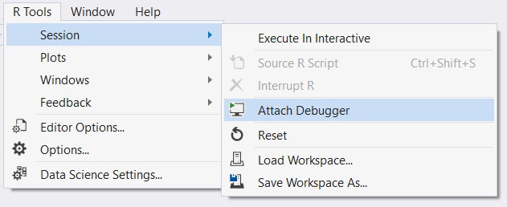
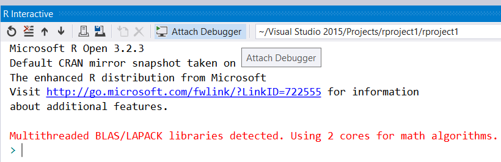
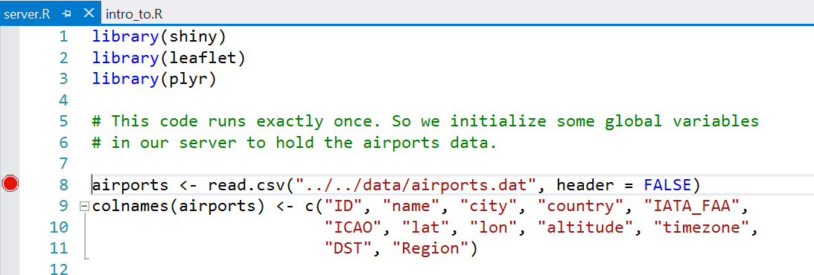

# Debugging with R Tools for Visual Studio

## Attaching the debugger

If you're an experienced Visual Studio user, you'll find that the debugging
experience is a bit different from what you may be used to. For example, if
you're writing a C# console application, you're used to just pressing **F5**
to launch your console application under control of the debugger.

In the R World, the experience is a bit different. (See note [1] below.)

First, you must attach the debugger to the R Runtime. You can do this one of two
different ways:

1. Use the R Tools menu - there is an Attach Debugger command under the Session
   menu:

  

In your everyday work you should use the toolbar in R Interactive, as it saves
you a number of mouse clicks / keystrokes:

  

## Set breakpoints

Once you've attached the debugger to R, you'll need to set breakpoints and tell
R the code that you want to debug. The latter is referred to as *sourcing* your
file, which tells the R interpreter to run the code inside the file. Since
you've attached a debugger to the R process, execution will stop at the first
appropriate breakpoint.

For example, if the code that you want to debug is at global scope (i.e., not
within a function) in a file called server.R, you would:

1. Attach the debugger to R (you'll notice that Visual Studio will change your
   window layout to the debugger window layout).
2. Set a breakpoint in the file in the example below, this is on line 8.
3. Source the file you can do this via R Tools/Session/Source R Script command,
   or by typing **CTRL+R**, **CTRL+S** with the input focus set to the editor.
   (See note [1] below.)

  

All standard Visual Studio debugger commands work, with a few known limitations.
You can:

* Set, Delete, and Deactivate Breakpoints
* Step Over (**F10**) and Step Into (**F11**) the current line
* Continue Execution (**F5**)
* Inspect local variables using the Locals Window
* Inspect arbitrary expressions (that are in scope) using Watch Windows
* Stop Debugging (**SHIFT-F5**)

**Note**: we haven't implemented support for Step Out (**SHIFT+F11**) in the preview
release.

After each debugger command, you'll also see that you are stopped at the
Environment Browser prompt in the R Interactive Window.  From there, you can
also issue Environment Browser commands (e.g., n for next command, or c to
continue execution). 

### Known Issues in the Debugger:

* Setting a breakpoint on the first line of a function declaration doesn't
work: line 1 the example below, so don't do this:


f <- function(x) {
    print(x + 1)
}


* We are working on adding data tips (hover over a variable to see information
display the value of the variable) for a future release.

* If you are stopped on a breakpoint you may need to press **F10** multiple
times to step over the line that contains the breakpoint. This is a known
issue with R itself (you see similar behavior in RStudio), and we are working
on a long term fix for this. You can simply turn off the breakpoint on that
line and continue stepping without having to press F10 multiple times to get
over that line. 

[1] R is different than C# because there isn't a main() function to start
debugging at. Furthermore, since there isn't a compilation step either, you
need to first tell RTVS what code you would like to debug. In this way, R is
more like ASP.NET debugging, where you need to tell Visual Studio which page to
start debugging at. In the Public Preview of RTVS, we're looking to make the
model more similar to the ASP.NET model to simplify things, and to allow you to
return to F5-style debugging.  

Note that calling the standard source() function from the R Interactive Window
will not work in this scenario. 
