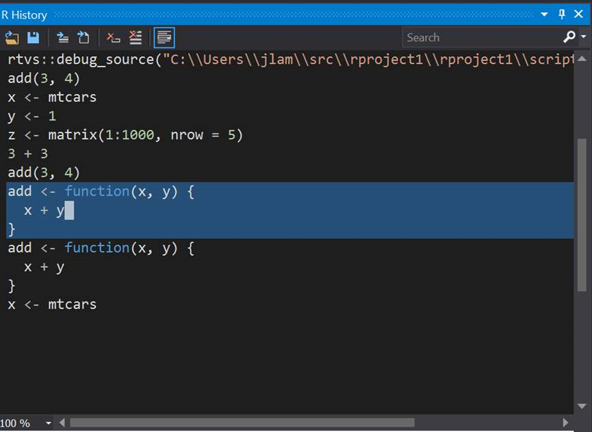

# Editing in R Tools for Visual Studio
 
## <a name="editing-window">Editing window
We have support for auto complete in the editor window:
 

 
You can select code within the editor and send to the REPL using **CTRL-ENTER**:
 

 
If you press **CTRL-ENTER** in the editor without selecting any text, it will send the current line that the cursor is on to the REPL, and then advance to the next non-whitespace line. This makes it convenient to execute a sequence of code from the editor simply by pressing **CTRL-ENTER** without the need to advance the cursor to the next line. In the example below, the cursor was originally on the line in the editor window with the "1", and **CTRL-ENTER** was pressed twice. 
 
 
 
d.	The editor supports automatically formatting R code based on your preferences. For example, if you had a function definition all on a single line:
 

You can reformat the code by selecting it, right clicking on the selection, and running the Format Selection command. Or you can also just type the shortcut key chord **CTRL+K**, **CTRL+F**.
 
 
 
The editor also supports formatting an entire document. So if you loaded a large document of R code that you wanted to format to your coding conventions, you can open the file in the RTVS editor, and select Format Document from the Edit menu, or by pressing the shortcut key chord **CTRL+K**, **CTRL+D**.
 
 
 
You can define your own R coding conventions by invoking Tools | Options from the Visual Studio main menu:
 
 

This brings up the Options dialog box. Once that is open, you can scroll down until you reach the Text Editor node. Click the chevron to open it and scroll down until you reach the R section. Here, you will find all of the editor configuration settings for R. 
 
 
 
Another way to quickly get to the R editor options is to use the R Tools top level menu:
 
 
 
Within the dialog box, if you select the **Advanced** options, you can define how you want your code formatted:
 
  

This includes whether you want RTVS to automatically format code based on your preferences when you type it, or whether you want it to reformat code that you paste into RTVS from the clipboard. This is helpful when you are pasting in code that you copy from a web browser, for example.

 
Undoing formatting. If you have **Format** on paste enabled in the RTVS options, and you want to preserve the formatting in the pasted code without permanently turning off the **Format** on paste option in RTVS, all you need to do is paste it into RTVS and press **CTRL-Z** to undo the formatting changes.
 
From the **R Tools** top-level menu, you can also bring up general RTVS settings using the **Options** command:
 
  

Which brings up:
 
  

There are a number of configurable options here:

- **CRAN Mirror** controls which CRAN mirror to download packages from by default.
- **R Engine**  
- **Send to R Console shortcut** lets the user redefine what keyboard shortcut sends the current editor selection to the REPL.
- **Load workspace when project opens**: when you open a RTVS project in VS if this option is set to *Yes*, it will automatically load the Workspace file (.RData) in the project directory. *Ask* will prompt the user.
- **Save workspace when the project closes** will automatically write the R execution context to the .RData file when the project closes. Other options are *No* and *Ask*.

## <a name="history-window">History window
We now have a History window that shows all of the commands that you have typed into the R Interactive Window. If you want to “replay” a command, double-click on the line in the History Window that you want to send to the R Interactive Window. You will need to press ENTER in the R Interactive Window to actually run the command. One notable feature of the R History Window is that it supports multi-line mode (enabled by default). In this mode, we will send a multi-line statement (e.g., a function definition) in its entirety to the R Interactive Window when you double click on it:

  

If you don’t like this multi-line functionality, you can always turn it off by clicking on the icon on the far right of the R History toolbar. You also have the option to save your history, load a previous history from a file, send a command to the R Interactive Window or the active editor, as well as clearing all the entries in the History Window.

 

