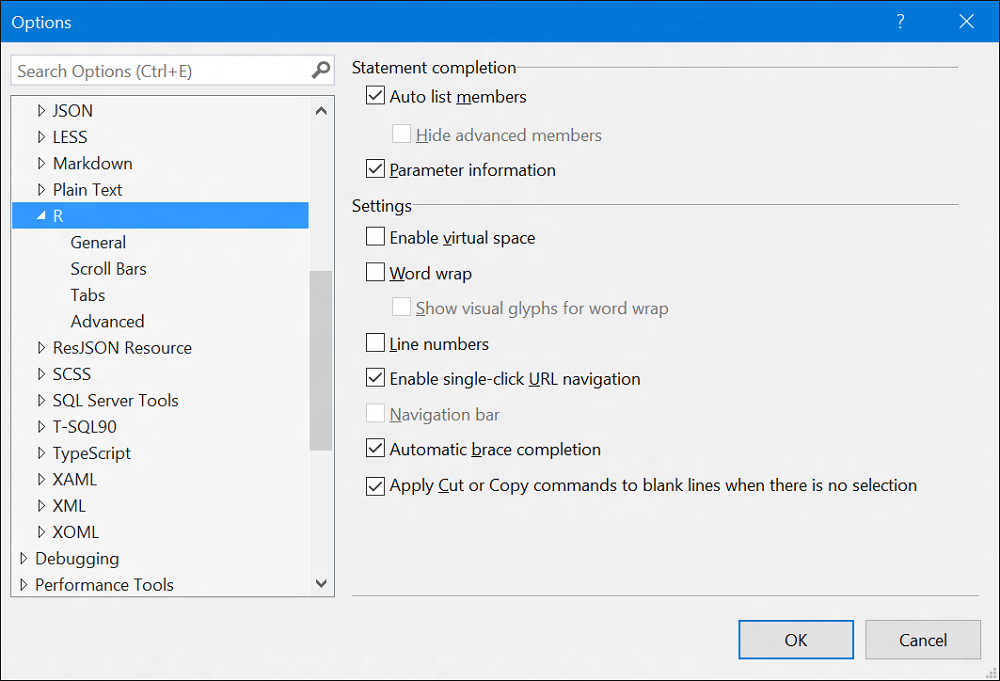
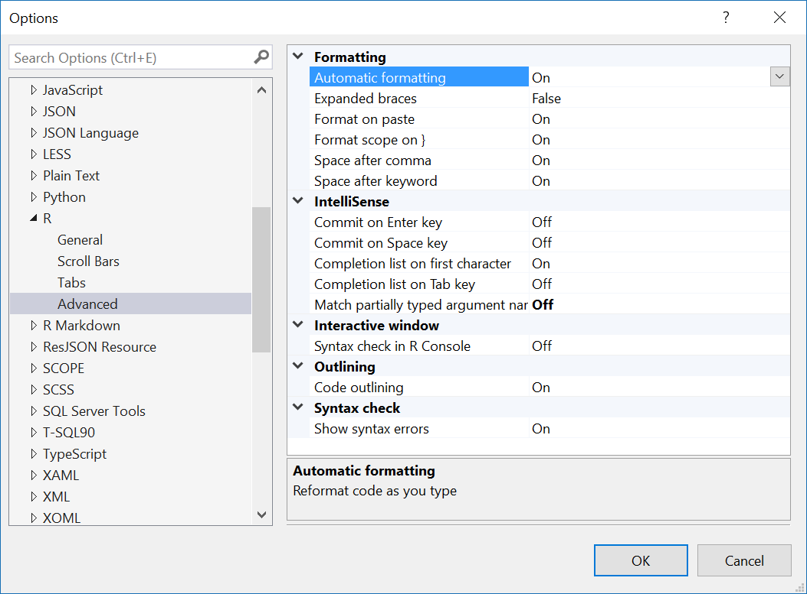
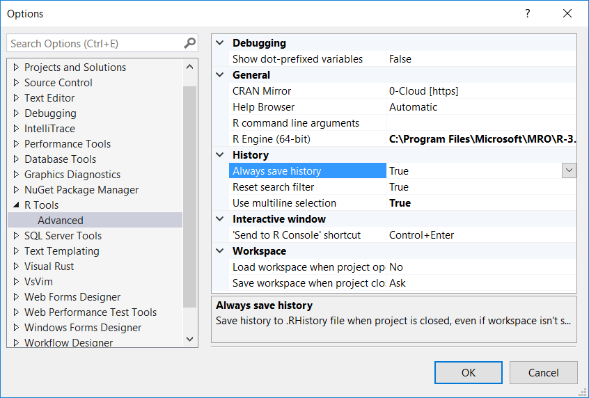

# Editing in R Tools for Visual Studio
 
The Visual Studio editor is a powerful editor that we have tailored for your
needs as an R user. This section walks you through some of the key features of
the editor. Since the editor is part of Visual Studio and *extensible*, you have
the full range of Visual Studio extensions available to you as well. For
example, if you prefer vim key bindings, you can install the [free VsVim
extension](https://visualstudiogallery.msdn.microsoft.com/59ca71b3-a4a3-46ca-8fe1-0e90e3f79329)
from the Visual Studio gallery.

## Editing window

When you are writing code in the editor, we will pop up IntelliSense for
library functions: 
 

 
A very common style of programming involves write code in the editor, and then
selecting and sending lines to the R Interactive window (also known as a
Read-Eval-Print-Loop or REPL). You can select code within the editor and send to
the REPL using **CTRL-ENTER**:
 

 
If you press **CTRL-ENTER** in the editor without selecting any text, it will
send the current line that the cursor is on to the REPL, and then advance to the
next non-whitespace line. This makes it convenient to execute a sequence of code
from the editor simply by pressing **CTRL-ENTER** without the need to advance
the cursor to the next line. In the example below, the cursor was originally on
the line in the editor window with the "1", and **CTRL-ENTER** was pressed
twice. 
 
 
 
## Code Formatting

The editor supports automatically formatting R code based on your preferences.
For example, if you had a function definition all on a single line:
 

You can reformat the code by selecting it, right clicking on the selection, and
running the Format Selection command. Or you can also just type the shortcut key
chord **CTRL+K**, **CTRL+F**.
 
 
 
The editor also supports formatting an entire document. So if you loaded a large
document of R code that you wanted to format to your coding conventions, you can
open the file in the RTVS editor, and select Format Document from the Edit menu,
or by pressing the shortcut key chord **CTRL+K**, **CTRL+D**.
 
 
 
You can define your own R coding conventions by invoking Tools -> Options from
the Visual Studio main menu:
 
 

This brings up the Options dialog box. Once that is open, you can scroll down
until you reach the Text Editor node. Click the chevron to open it and scroll
down until you reach the R section. Here, you will find all of the editor
configuration settings for R. 
 
 
 
Another way to quickly get to the R editor options is to use the R Tools top
level menu:
 
 
 
Within the dialog box, if you select the **Advanced** options, you can define
how you want your code formatted:
 
  

This includes whether you want RTVS to automatically format code based on your
preferences when you type it, or whether you want it to reformat code that you
paste into RTVS from the clipboard. This is helpful when you are pasting in code
that you copy from a web browser, for example.
 
You can also undo formatting. If you have **Format** on paste enabled in the
RTVS options, and you want to preserve the formatting in the pasted code without
permanently turning off the **Format** on paste option in RTVS, all you need to
do is paste it into RTVS and press **CTRL-Z** to undo the formatting changes.
 
From the **R Tools** top-level menu, you can also bring up general RTVS settings
using the **Options** command:
 
  

Which brings up:
 
  

There are a number of configurable options here:

### Debugging

**Evaluate active bindings** Ensures that you always get the most up to date
value when inspecting variables and properties in the Variable Explorer, and
Debugger Tool Windows like Watch and Locals. The risk is that evaluating the
expressions may cause side-effects, depending on how they were implemented.

**Show dot-prefixed variables** Shows variables prefixed with "." in Variable
Explorer and Debugger Tool Windows.

### General

**Survey/News Check** Survey/News is a feature that pushes news about RTVS
updates and surveys. This setting controls the frequency of how often RTVS
checks for updates.

### Help

**F1 Web browser** Controls how help is displayed when you are searching for a
term using CTRL+F1. When set to `Internal`, you will see help rendered within a
tool window in Visual Studio. When set to `External`, you will see help rendered
using your default web browser.

**F1 Web Search String** Controls how search terms are passed to your search
engine when you press CTRL+F1 on a term in the editor. By default the string is
`R site:stackoverflow.com`, which replaces `R` with your search term. The
`site:stackoverflow.com` is a directive to the search engine which tells it to
scope the search to pages within the `stackoverflow.com` domain. You can edit
this string to contain whatever you want; however you must retain the `R` token
somewhere within your search string.

**R Help Browser** Controls how help is displayed when you are searching the R
documentation using F1, `?` or `??`. When set to `Automatic`, you will see help
rendered within a tool window in Visual Studio. When set to `External`, you will
see help rendered using your default web browser.

### History

**Always save history** Controls whether RTVS writes your command history to a
`.RHistory` file in your working directory whenever the project is closed. Note
that this happens even if you don't save your project before you exit.

**Reset search filter** The History window can filter your command history to
show only the commands that substring match against the filter term in the R
History dialog. This setting determines whether to reset your History search
filter whenever you run a new command, or switch to a new project, which will
trigger the load of a different `.RHistory` file. The default setting of `Yes`
minimizes surprise when you execute a command with a filter set, and you wonder
why the command you just ran didn't show up in the History.

**Use multiline selection** It is quite common to execute statements that span
several lines in the Interactive Window. The default setting of `Yes` will let
you single click a multi-line statement in History to select it.

### HTML

**HTML Pages browser** When viewing content such as a `ggvis` plot, or a `shiny`
application, the output will be rendered in a web browser. The default setting
of `Internal` will show your HTML output within a tool window in Visual Studio.
When set to `External`, you will see your HTML output rendered using your
default web browser.

### Logging

**Log events** This setting controls the verbosity of the logging used for RTVS
diagnostics. The default setting of `Normal` creates a log file in your TEMP
directory. When set to `Traffic`, RTVS logs all commands, and responses in your
session. These log files never leave your machine, but may be helpful for
diagnosing problems in RTVS.

### Markdown

**Markdown preview browser** When viewing RMarkdown HTML output, the default
setting of `Internal` will show your RMarkdown HTML document within a tool
window in Visual Studio. When set to `External`, you will see your RMarkdown
HTML document rendered using your default web browser.

### R Engine

**Code page** The default setting of `OS Default` will instruct R to use the
default OS locale. You can use the dropdown to change the locale setting to a
different local as well.

**CRAN Mirror** The default setting of `Use .Rprofile` will respect the CRAN
Mirror settings in your `.RProfile` file. You can override this setting by
selecting one of the listed CRAN mirrors in the dialog.

**Working directory** This is the current working directory, and is typically
set whenever a project is opened.

### Workspace

**Load workspace when project opens** The default setting of `No` disables
loading of the session data from the `.RData` file into the global environment
when the project is opened.

**Prompt to save workspace on reset** The default setting of `No` disables
prompting of saving your workspace when you click on the Reset button in the
Interactive Window.

**Save workspace when project closes** The default setting of `No` disables
saving the global environment to the `.RData` file when the project is closed.

**Show confirmation dialog before switching workspaces** The default setting of
`No` disables prompting the user for confirmation when switching between
different workspaces.
  