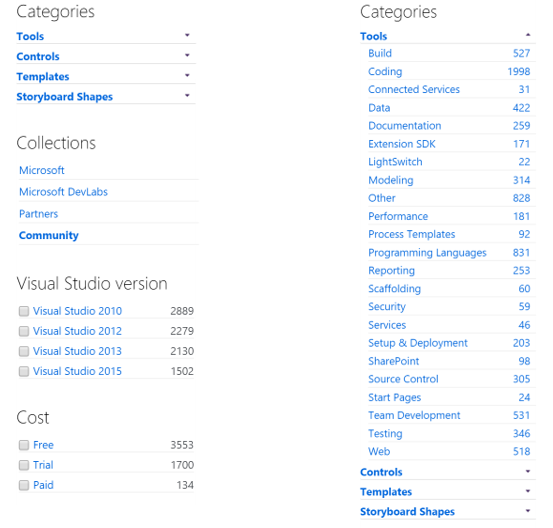
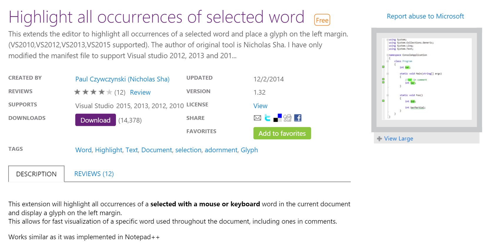
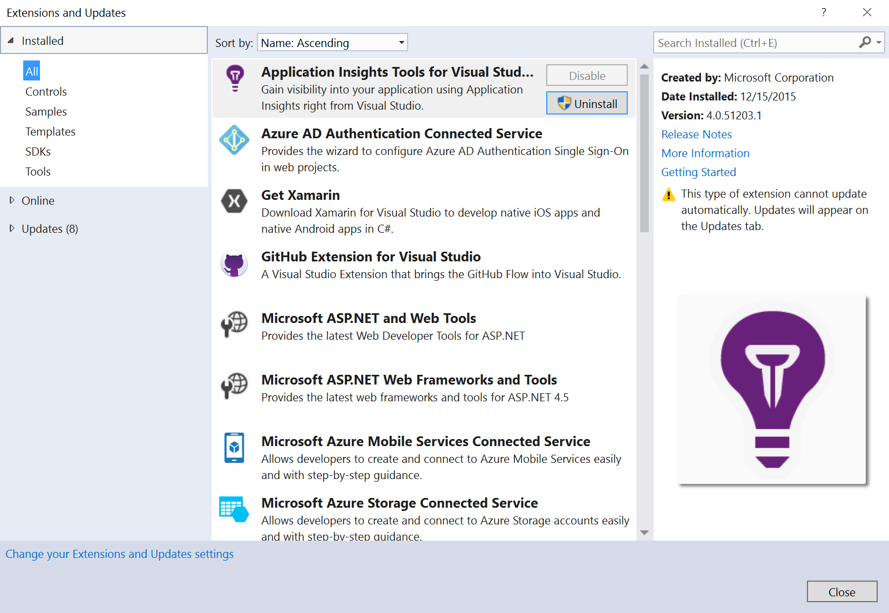

# Extensions for every need

Being part of Visual Studio means you have access to a large library of Extensions, both free and paid.  These cover a wide spectrum from Tools to Controls to Data:

These Extensions are provided by Microsoft, Microsoft DevLabs, and most importantly by the Community.

You can write your own Extension and provide it for free or sell it to a [large global market](https://www.visualstudio.com/en-us/integrate/explore/explore-vside-vsi.aspx).

For example, here's a free Extension that highlights all words that match your selection (a feature not yet available in RTVS):

To install an Extension, go to Tools / Extensions and Updates:

