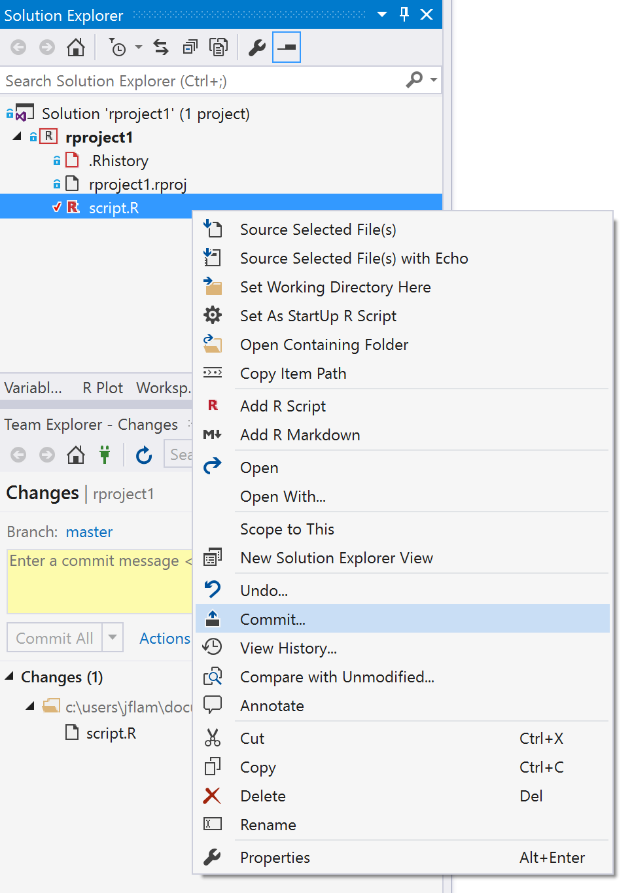
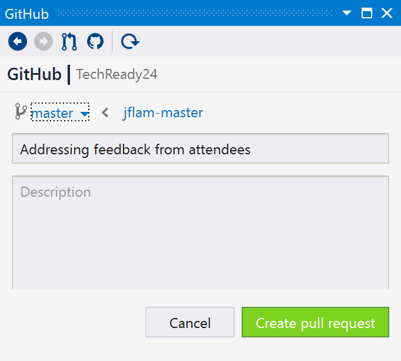

# Git and Github support

Visual Studio supports many source code control systems. Git is an extremely
popular source control system, and Visual Studio makes it easy to create a new
git repository to hold your new R projects. Just check the Create new Git
repository checkbox when creating your new R project:

Once you've edited a file, you can right click on it and commit your changes as
shown below.  This will bring the git commit dialog with the usual options:

For further information on using Git, please see the [Visual Studio git
documentation](https://www.visualstudio.com/learn-git/).

# Github 

You can also use [Github](https://github.com) directly from RTVS. First, you
must install the [Github for Visual Studio
extension](https://visualstudio.github.com/).

This extension enhances your git experience in Visual Studio by bring branch management and pull request creation directly into your Visual Studio workflow.