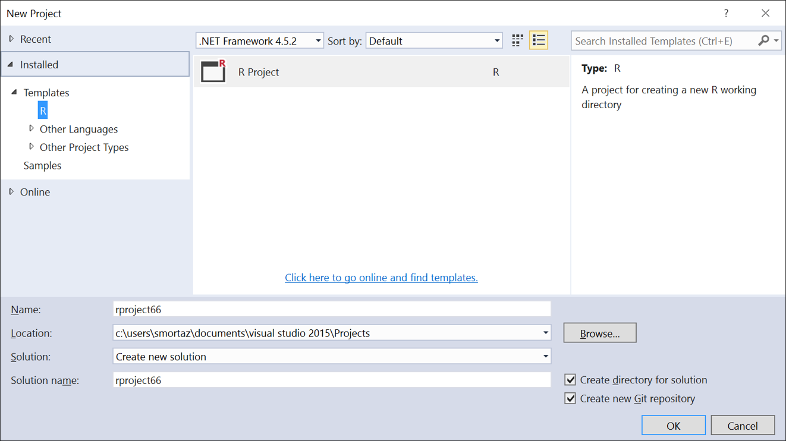
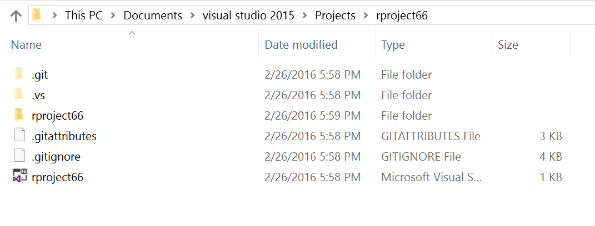
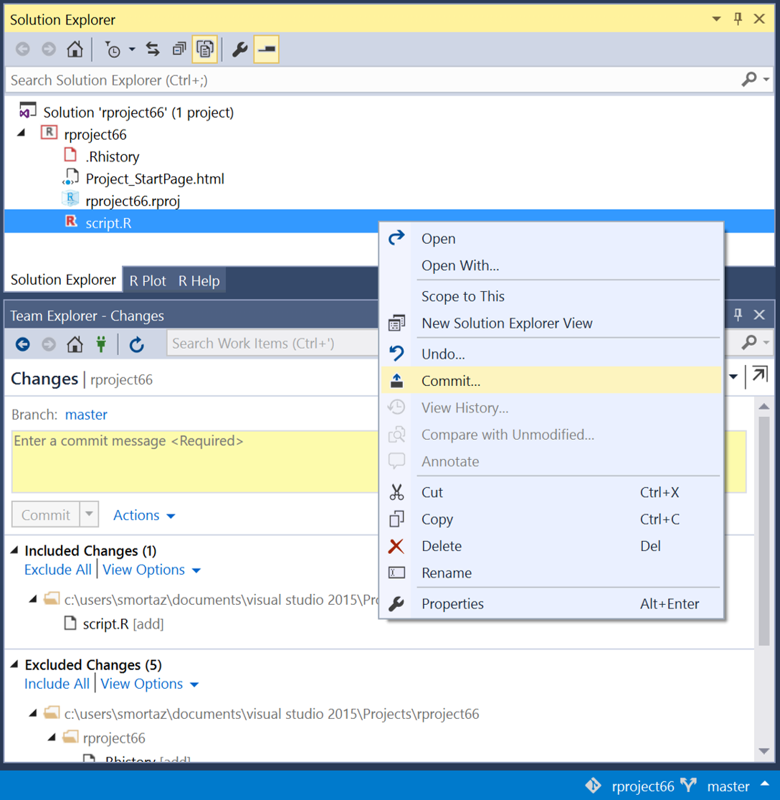
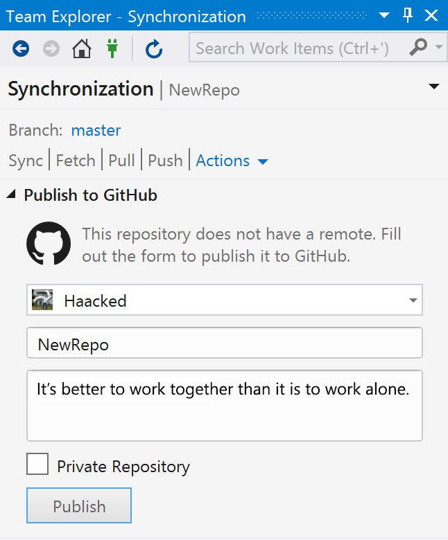

# Git and Github support

You can use several source code control systems with RTVS. When creating your project (Ctrl-shift-N), on the bottom right corner, select the git option:

If you right click on your Solution and open the directory, you'll see that git support files have been created:

Once you've edited a file, you can right click on it and commit your changes as shown below.  This will bring the git commit dialog with the usual options:

For further information on using Git, please see the main VS documentation.

# Github 

You can also use Github directly from RTVS.  You need to install a plug-in that provides this support.  This is covered on https://visualstudio.github.com/ page in detail.

This extension provides support for creation, authentication, cloing, publishing, etc. your work on github.

