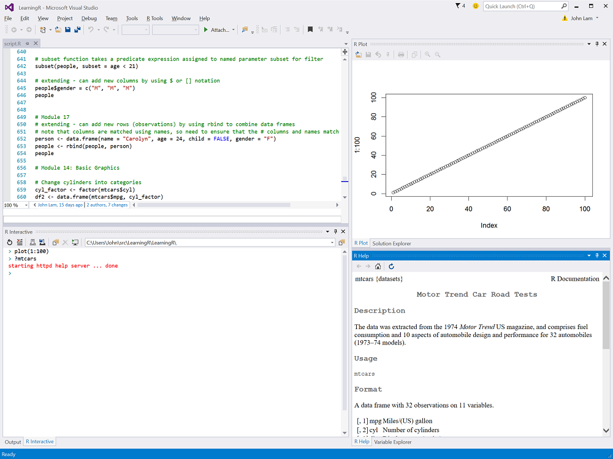
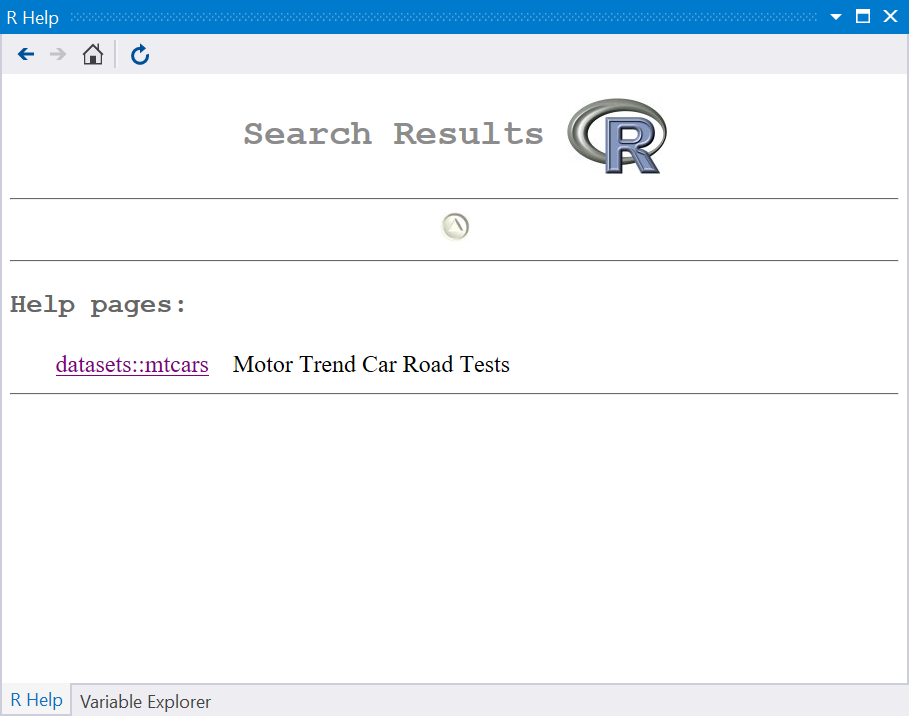
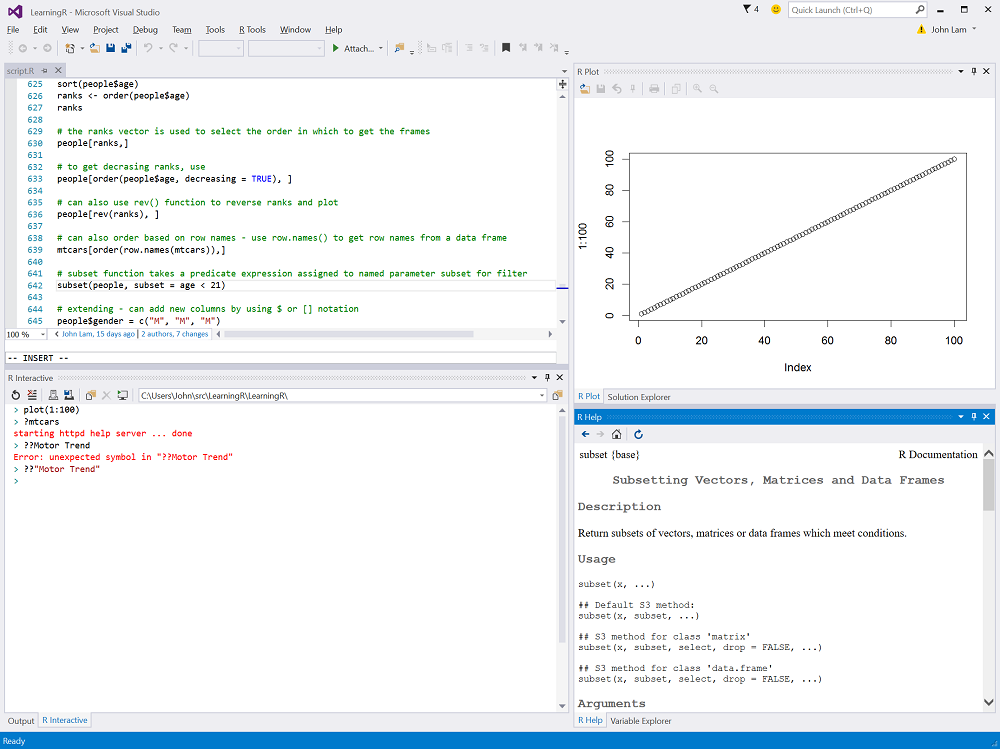
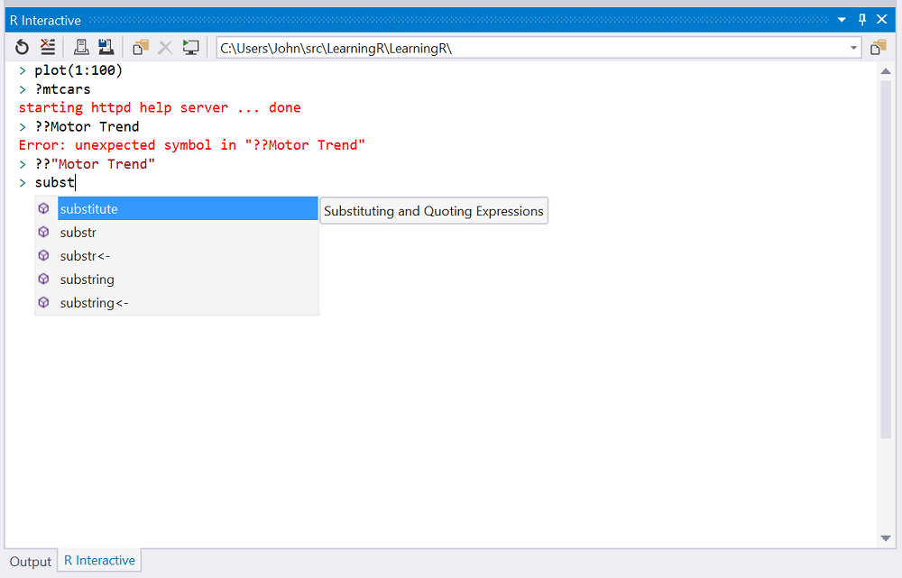

# Help in R Tools for Visual Studio

The help window pops up within Visual Studio as a tool window. You can get help for a specific topic by title using the `?` command in R:

	> ?mtcars

All standard Visual Studio tool window behavior is available to the **R Help** window.

You can search help using the ?? command in R. Note that you have to quote the search term if it includes spaces.

	> ??"Motor Trend"

You can place the cursor over a function in the editor or the REPL window and press **F1** to get help on that function:

 
You can right-click on a function in the editor or the REPL window

 
Pressing **F1** during an auto-complete operation will send the sub-string used for the auto-complete to the R search engine to return a set of pages that match that sub-string search:

To bring up results:

