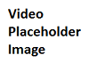

---
layout: default
---
# Getting Started with R Tools for Visual Studio

Welcome to R Tools 0.1 for Visual Studio (RTVS)!
 

## Key features in Version 0.1

* Shahrokh was here
* Full Visual Studio editing experience, including tabbed windows, syntax highlighting, and more!
* Debugging support, with breakpoints, stepping, watch windows, call stacks and more!
* Interactive R: work with the R console directly from within Visual Studio
* IntelliSense (also known as command completion) available in both the editor and the Interactive R window
* History window: see all of the commands that you have entered in a scrollable window
* Integrated plotting support: see all of your R plots in a Visual Studio tool window
* Integrated Help: use ? and ?? to view R documentation within Visual Studio
* Variable Explorer that lets you drill into your R data structures and examine their values
* Table Viewer: quickly see values in your data frames
* Simplify your Visual Studio environment for Data Science by bringing the most commonly used commands to the forefront

## Guide to the documentation

* [Install R Tools for Visual Studio](installation.html)
* [Overview Videos](videos.html)

**Tutorials**

* [How to start a new project using RTVS](start-project.html)

**Features in Depth**

* [Editing](editing.html)
	* [Editing window](editing.html#editing-window)
	* [History window](editing.html#history-window)
* [Interactive REPL](interactive-repl.html)
	* [Interactive REPL in general](interactive-repl.html#repl-general)
	* [REPL history](interactive-repl.html#repl-history)
	* [Auto-complete behavior](interactive-repl.html#auto-complete)

* [Variable Explorer](variable-explorer.html)
* [Plotting](plotting.html)
* [Debugging](debugging.html)
* [Help](help.html)

## Feedback
We’re looking for your feedback! Please use our feedback tool to send us smiles and frowns!
