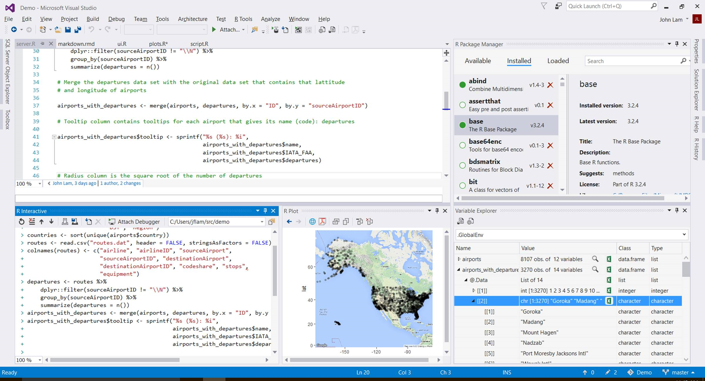

# Welcome to R Tools for Visual Studio Preview!



## About this release

THANK YOU for checking out this early version for RTVS.  We've decided to make it available early so that we'll have more time to address your feedback.  As such, there are bugs and many missing features, so please beware!  This release is meant for evaluation purposes only and not for production use.

## Key features in Version 0.2


* [Editor](editing.html) - full edit experience including tabbed windows, syntax highlighting, and more
* [History window](history.html) - see all of the commands that you have entered in a scrollable window
* [R Interactive Window](interactive-repl.html) - work with the R console directly from within Visual Studio
* [IntelliSense](intellisense.html) - (aka Completion) available in both the editor and the Interactive R window
* [Variable Explorer](variable-explorer.html) - lets you drill into your R data structures and examine their values
* [Plotting](plotting.html) - see all of your R plots in a Visual Studio tool window
* [Debugging](debugging.html) -  breakpoints, stepping, watch windows, call stacks and more!
* [R Markdown](rmarkdown.html) - R Markdown/knitter support with export to Word and HTML
* [Git](git.html) - Source code control via Git and Github
* [Polyglot IDE](polyglot.html) - VS supports R, Python, C++, C#, Node.js, SQL, … projects simultaneously
* [Help](help.html) - use ? and ?? to view R documentation within Visual Studio


## A quick video overview 
<iframe width="560" height="315" align="middle" src="https://www.youtube.com/embed/VEOhaP4x7LE" frameborder="0" allowfullscreen></iframe>

<br>

## Installation and first steps

RTVS prerequistes are : VS 2015 + VS Update 1 + an R interpreter. 

Please check out the installation steps, *especially* if you are new to Visual Studio

* [RTVS Installation](installation.html) 

Once installed, create a project and code away!

* [How to start a new project in RTVS](start-project.html)


## Feedback, bugs, etc.

For a list of existing bugs and feature requests, and to file new bugs, please go to:

[https://github.com/Microsoft/RTVS/issues](https://github.com/Microsoft/RTVS/issues)

(currently private - pls use rtvsuserfeedback@microsoft.com for now)

<hr>
<hr>
<hr>

<br>

## FAQ

**Q. Should I use RTVS in production mode?**

A. No. This is the very first public preview.  As such there are many bugs and many many missing features which will be addressed in the next few months.  This release is only recommended for evaluation purposes and usage in production is strongly advised against.

**Q. Is RTVS going to be free?**

A. Yes! RTVS when combined with Visual Studio Community Edition is a complete
and perpetually free IDE. RTVS itself will also be Open Source. We will
release the code on Github when it is ready. Parts of the source code that link
to R are already available under GPLv2 at the [R-Host repository on
Github](https://github.com/microsoft/R-Host).

**Q. What versions of Visual Studio does RTVS run on?**

A. Visual Studio 2015 Update 1. Community, Pro, and Enterprise Editions.

**Q. Does RTVS work with Visual Studio Express editions?**

A. No.

**Q. What R interpreters does RTVS work with?**

A. CRAN R, Microsoft R Open, and Microsoft R Server.

**Q. Where can I download these interpreters?**

A. See the [installation](installation.html) instructions.

**Q. Since RTVS is in VS, does it mean that R can be easily used with C#, C++ and
other Microsoft languages?**

A. No. RTVS is a tool for developing R code, and uses the standard native R
interpreters. We do not have any support currently for interop between R and
other languages.

**Q. Feature X is missing, but RStudio has it!**

A. RStudio is a fantastic and mature IDE for R that's been under development for
years. RTVS is a long way from RStudio, because we've only been developing it
for months. We hope to have all the critical features that you need to be
successful in the coming year. Please help us prioritize the TODO list by taking
the [RTVS survey](https://www.surveymonkey.com/r/RTVS1).

**Q. Will RTVS work on MacOS / Linux?**

A. No. RTVS is built on top of Visual Studio, which is a Windows-only
implementation. However, we are looking at porting RTVS to run on top of Visual
Studio Code, which is the new cross-platform IDE from Microsoft.

**Q. Can I contribute to RTVS?**

A. Absolutely! We will release the source in the near future, and PRs are very
welcome. For now, the most important contribution is feedback and bug reports.

**Q. I want to save my plots as PDFs. What software do I need for that?**

A. See above.

**Q. Does RTVS work with my source control system?**

A. Yes, you can use any source control system that is integrated into Visual
Studio. e.g., TFS, git, SVN, hg etc.

**Q. I don't use a US English locale in Windows or in VS. Will RTVS work?**

A. It should. However, we haven't done extensive testing in non-US English
locales. For the best experience with the Preview bits, please set your local to
English in Visual Studio. You can do so through Tools / Options dialog box,
setting International Settings Language to English. If English is not available
in the drop-down, you'll need to install the [Visual Studio Language
pack](https://www.microsoft.com/en-us/download/details.aspx?id=48157).


**Q. Will RTVS work with 32-bit editions of R?**

A. No. RTVS only supports 64-bit editions of R.

**Q. What are the key missing features of RTVS currently?** 

A. There a number of these.  For example:

* There is no UI for package installation or creation
* Variable Explorer does not allow edit, search, sort and supports global scope only
* Refactoring in the Editor
* Shiny apps inside RTVS (pop out is ok)
* Interactive ggviz plots inside RTVS (pop out is ok)
* Customization options when saving plots as PDF or bitmaps

We'll be addressing these in the near future.

**Q. I really like my current Visual Studio settings, but I want to try out the
new Data Science settings. What should I do?**

A. You can always save your current Visual Studio settings through Tools ->
Import and Export Settings... command. You can also use this command to
restore one of the default Visual Studio settings (e.g., C++ or General).

**Q. I'm getting the error "Input is too long - no more than 4096 characters
expected"**

A. We're working on fixing this for the next release. If you want to run the
entire file, you can try right clicking on the editor and running the Source R
Script command (or hitting CTRL+SHIFT+S). 

**Q. After installing RTVS, the R Interactive Window doesn't work at all. I
don't even get a > prompt.**

A. This bug can occur when you have Visual Studio installed in a non-default
location. To unblock you, copy `Microsoft.R.Host.exe` from

```
C:\Program Files (x86)\Microsoft Visual Studio 14.0\Common7\IDE\Extensions\Microsoft\R Tools for Visual Studio
``` 

to 
 
```
[VS_LOCATION]\Common7\IDE\Extensions\Microsoft\R Tools for Visual Studio
```

where VS_LOCATION is where you installed Visual Studio. We will fix this in the
next release.

**Q. After installing RTVS on top of Visual Studio Update 1, Visual Studio
crashes on startup every time I try to run it. What can I do?**

A. Try resetting Visual Studio settings from the command line. Open a Visual
Studio command prompt and type:

```
devenv.exe /ResetSettings
```

or navigate to `C:\Program Files (x86)\Microsoft Visual Studio 14.0\Common7\IDE`
first in a command prompt and type:

```
devenv.exe /ResetSettings
```

**Q. What is the recommended `.gitignore` settings for an RTVS project?**

A. Gitub maintains a master repository of recommended `.gitignore` files. You
can see it here: [R .gitignore](https://github.com/github/gitignore/blob/master/R.gitignore)

## Feedback

We're looking for your feedback! Please use the R Tools / Feedback menu to send
us smiles and frowns!

## Contributing

If you're interested in contributing to the docs or samples, feel free to clone
the repo and submit a PR. More instructions can be found in our [contribution
guide](contributing-docs.html).

