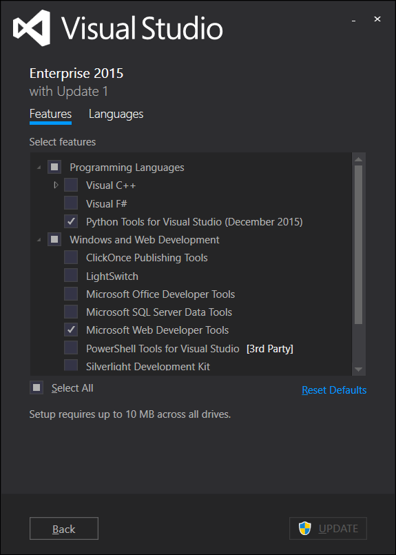
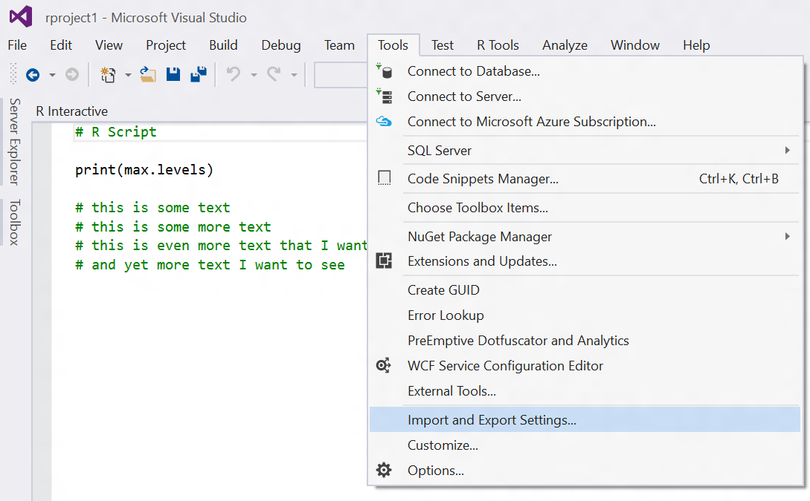
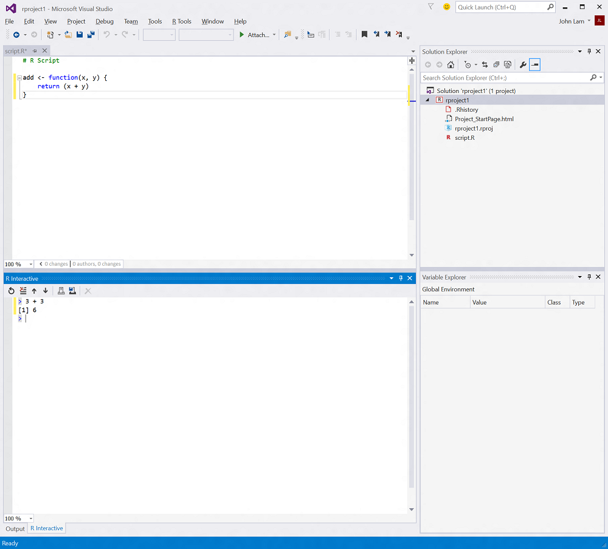

# Install R Tools for Visual Studio

R Tools for Visual Studio is a free extension for Visual Studio 2015 that brings
the Visual Studio IDE experience to R users. This is a preview release, that is
intended for early adopters who are eager to try out our new data science
experience for R and Visual Studio users. Please send us feedback!

## Prerequisites

RTVS Preview can **only** be installed on Visual Studio 2015 Update 1. We
support the following editions of Visual Studio:

* [Visual Studio 2015 Community](https://www.visualstudio.com/en-us/products/visual-studio-community-vs.aspx) (free)
* Visual Studio 2015 Professional 
* Visual Studio 2015 Enterprise

Please go to Help / About to check your version of Visual Studio.  It should be
VS 2015 or VS 2015 with Update 1.

While installing Visual Studio 2015, please make sure that you have the Web
Developer Tools option checked. This is checked by default, so if you're
installing using the default Visual Studio settings, you'll be fine. We will be
removing this dependency in the future.

Once you've installed VS 2015, if you do not have Update 1, install it from
here:

* [Visual Studio 2015 Update 1](https://www.microsoft.com/en-us/download/details.aspx?id=49989)

RTVS Preview requires an installation of R on your computer. We only support
**64 bit** editions of R versions 3.2.1, 3.2.2 and 3.2.3. We support both the
CRAN R distributions as well as the Microsoft R distributions. You can download
them from for free from these locations:

* [Microsoft R Open](https://mran.revolutionanalytics.com/download/)
* [Microsoft R Server](https://www.microsoft.com/en-us/server-cloud/products/r-server/)
* [CRAN R](https://cran.r-project.org/bin/windows/base/)

If you don't have an R distribution installed before you install RTVS, you will
be prompted to install an R distribution during setup.

Next download the Public Preview of R Tools for Visual Studio.

Please note that if you had an earlier version of R Tools for Visual Studio
installed on your machine, you must first uninstall it from Add / Remove
Programs before you can install this Preview release.

## Window Layout for Data Scientists in Visual Studio

Visual Studio is a fantastic *developer tool*, and its user interface is
optimized around the needs of a developer. We realize that data scientists have
different needs, so we've come up with a streamlined experience that is tailored
for the needs of data scientists.

We know that some of you prefer to retain your existing Visual Studio settings,
so we leave things this way by default. However, for those of you who want our
tailored experience, enabling it is really easy to do. Just run the Data Science
Settings from the R Tools menu:

**IMPORTANT NOTE: you should save your current settings if you want to revert back to them: Tools / Import and Export Settings.**

		
After it is done, you'll have a Visual Studio layout that resembles this:

## Where is RTVS Preview installed?

R Tools for Visual Studio installs in this folder:

	%ProgramFiles(x86)%\Microsoft Visual Studio <VS version>\Common7\IDE\Extensions\Microsoft\R Tools for Visual Studio

## Try the samples

Once you've installed RTVS, try some of the samples from github:

[Samples documentation](samples.html)

