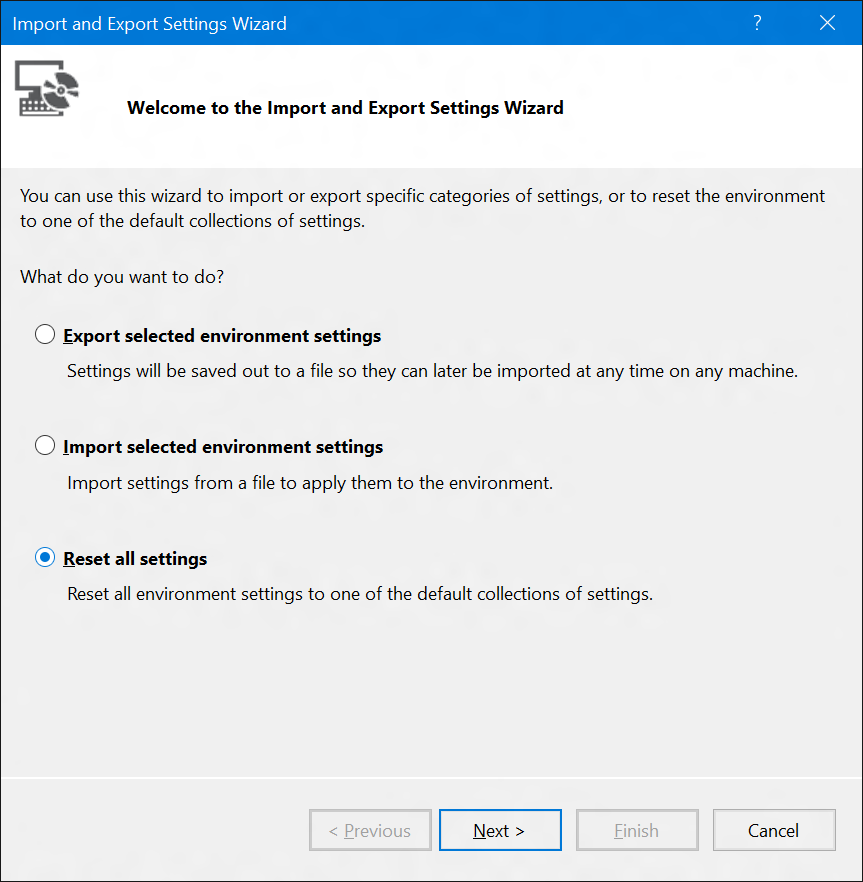
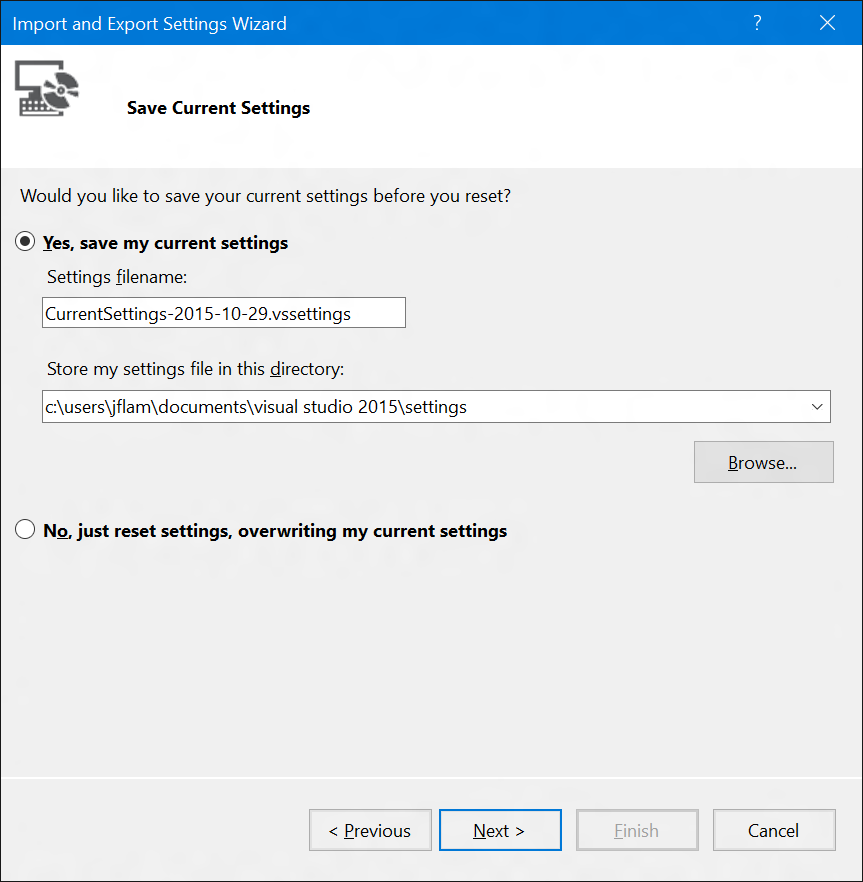
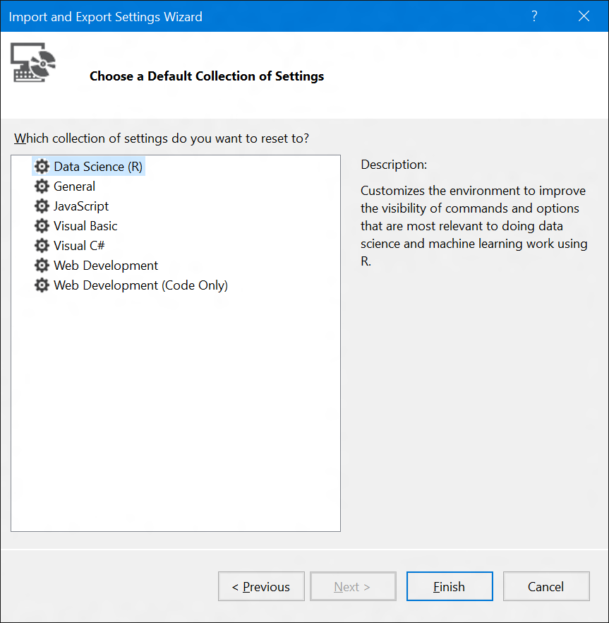
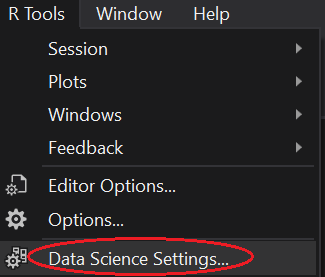

# Install R Tools for Visual Studio

## Prerequisites

RTVS can be installed in the following editions of Visual Studio:

* [Visual Studio 2015 Update 1 or higher](https://www.visualstudio.com/news/vs2015-update1-vs)

## Quick Start: Installation:

1. You must have **Visual Studio 2015 Update 1** or higher installed on your machine. Earlier versions of Visual Studio are not supported.
2. You may download Community Edition if you don’t already have a copy of Professional or Enterprise.
3. **Please (you must) uninstall any previous versions of RTVS that you may have on your machine.**
4. Install RTVS from: **\\\pytools\release\rtvs\preview3.1\rtvs.exe**
5. Select the Data Science mode when prompted during installation.

## A complete and perpetually free R IDE

The R Tools for Visual Studio 2015 extension is completely free, and there are several free Visual Studio editions that can use it.

* [Visual Studio 2015](http://visualstudio.com)
 * Community Edition
 * Express for Web
 * Express for Desktop

We recommend using **Visual Studio 2015 Community Edition**, which is the most powerful and has the best extension support. The Express for Web editions are focused on web development and have fewer features, while Express for Desktop includes C++ and features for native development but no web support.

## Install Scenarios for VS & RTVS

**Which one describes you?** | **Installation steps** | **Links**
----- | ----- | -----
I already have Visual Studio **2015** and just want R support | Install VS 2015 Update 1   Install RTVS | [VS 2015 Update 1](https://www.visualstudio.com/news/vs2015-update1-vs)  RTVS from \\\pytools\release\rtvs\preview3.1\rtvs.exe
I don't have VS installed and want the FREE RTVS/VS version! | Install VS 2015 Community Edition (recommended)  Install VS 2015 Update 1  Install RTVS | [Visual Studio 2015 Community Edition](https://www.visualstudio.com/)   RTVS from \\\pytools\release\rtvs\preview3.1\rtvs.exe)

## Window Layout for Data Scientists in Visual Studio

- RTVS provides settings that are custom-tailored for Data Scientists using R. You can set these settings either through the Visual Studio first run experience.
- You can manually reset to the Data Scientists settings through the **Tools** | **Import and Export Settings** menu command:
- You can use the new streamlined data scientist window layout settings Command
	

		
Select the **Reset all settings** option and click **Next**:

		
If you want to save your current settings, select a location to save your settings in this step:

		
In the **Final** step, select **Data Science (R)** settings and click **Finish**:

		
This will reset your Visual Studio windows to look like this:

		
This layout is quite similar to RStudio, so it should be quite familiar for current RStudio users.

### Streamlined data scientist window layout settings command

In response to feedback, we have created a new top-level command to reset Visual Studio to a simpler set of toolbars and menus that is more appropriate for the Data Scientist workflow. You can do this through the R new **Tools** | **Data Science Settings** command:

## Installation points for additional R programs

- [Install CRAN R](https://cran.r-project.org/bin/windows/base/)
- [Install Microsoft R Open](https://mran.revolutionanalytics.com/open/) 
- [Install Microsoft R Server](https://www.microsoft.com/en-us/server-cloud/products/r-server/)

## Where is RTVS 0.1 installed?
R Tools for Visual Studio installs in this folder:

	%ProgramFiles(x86)%\Microsoft Visual Studio <VS version>\Common7\IDE\Extensions\Microsoft\R Tools for Visual Studio

//TBD do not see these ??? registry entries - do see the Python ones:

A registry value `InstallDir` containing the full installation directory is stored at:

	(64-bit Windows) HKEY_LOCAL_MACHINE\Software\Wow6432Node\Microsoft\???\<VS version>

	(32-bit Windows) HKEY_LOCAL_MACHINE\Software\Microsoft\???\<VS version>

where `VS version` here is `14.0`.See below for full installation paths.
