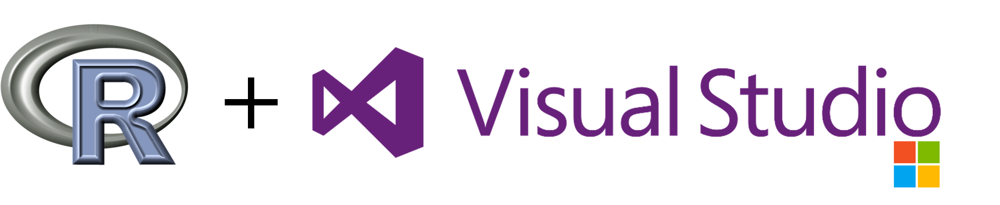

## Thank you for installing RTVS!

### About this release

Thank you for installing R Tools for Visual Studio! Please check it out and let
us know what you think. 

### Resources

* For a general overview of the features, please see the
  [documentation.](./index.html)
* To install RTVS, especially if you are new to Visual Studio, please see
  [Installation steps.](./installation.html)
* For a list of existing bugs and feature requests please visit our [Github
  issue tracker.](https://github.com/Microsoft/RTVS/issues)
* If you'd like to check out the source code, license and contribute, please see
  the [contribution
  guide.](https://github.com/Microsoft/RTVS/blob/master/LICENSE)
* To send feedback without using Github (which is preferred), please use the
  menu R Tools -> Feedback.

## Microsoft R distributions

RTVS supports CRAN R, and Microsoft R distributions. See the links below for
more information on the different Microsoft R distributions,

* [Microsoft R Open](https://mran.microsoft.com/download/)
* [Microsoft R Client](https://msdn.microsoft.com/en-us/microsoft-r/r-client-get-started)
* [Microsoft R
  Server](https://www.microsoft.com/en-us/server-cloud/products/r-server/)
