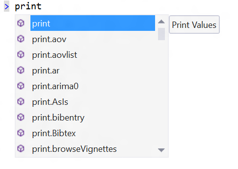
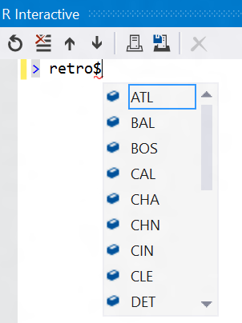
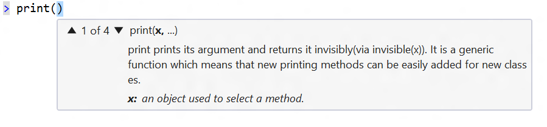
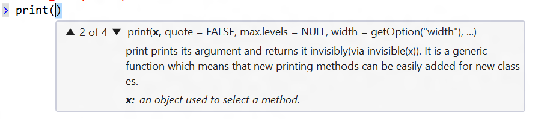
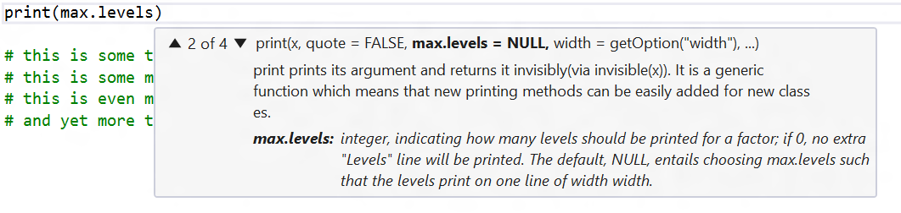

## IntelliSense

Typing in the REPL will trigger IntelliSense as you are typing. Note that we
have both the name of the function in the IntelliSense drop-down, as well a
brief summary of what the function does in a tool tip. Note that matches are
case-sensitive.

IntelliSense suggestions are also available for members of R objects:
 

To accept the current highlighted suggestion while typing, press the **TAB** key:

To dismiss the IntelliSense suggestions while typing, press the **ESC**.

To restore the IntelliSense suggestions while typing, press **CTRL-SPACE**.

For a function completion, when you type the open parenthesis character (, we
will auto-type the close parenthesis character and pop up function parameter
help:

Since there are multiple overloads for this function, you can click the down
caret with your mouse to get parameter help for the next overload:

 
You can dismiss the parameter help by pressing **ESC**.

If you have dismissed the parameter help pop-up and you want to get it back,
press **CTRL-SHIFT-Spacebar** to restore it.

If you find the parameter help is obscuring text underneath it, as can be the
case in the file editor, you can press and hold the **CTRL** key to make the
parameter help text translucent.

 
If you type a named parameter name with pop-up help showing, we will boldface
and display additional information about that parameter name in the help:

