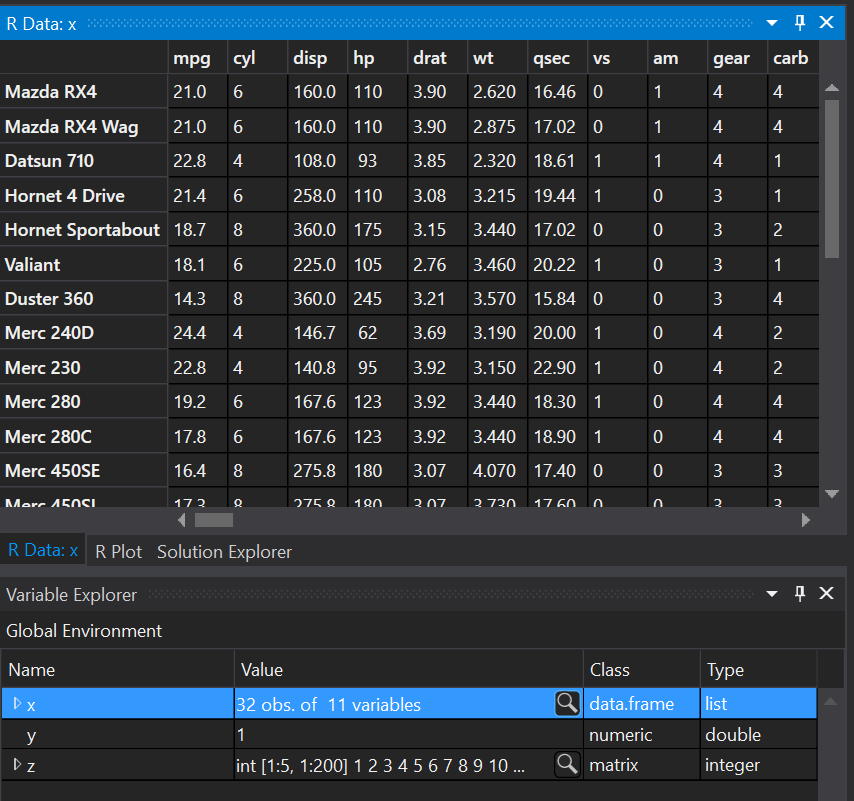
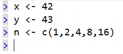
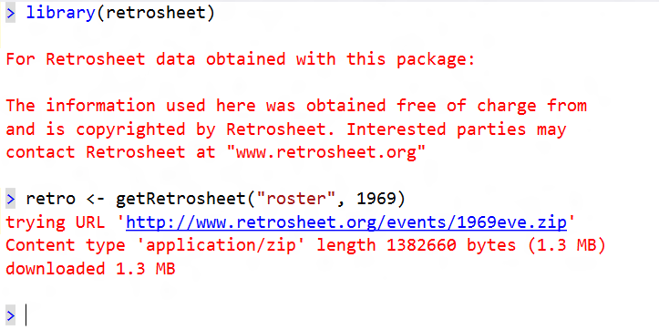

# Working with the Interactive Window

R Tools for Visual Studio (RTVS) includes interactive windows for each of your installed environments. Also known as **REPL** (Read/Evaluate/Print Loop) windows, these allow you to enter R code and see the results immediately. You can use all modules, syntax and variables, just like in an R script.

## REPL in general

Typing valid R code and pressing **ENTER** at the end of the line will execute the code on that line.

All previous input and output in the REPL is read-only and cannot be changed. You can select output using the mouse and copy to the clipboard using **CTRL-C**. You can also right-click using the mouse and select copy from the context menu:

You can paste input into the REPL by using **CTRL-V** at an input prompt or by right-clicking and using the context menu:

On a single-line REPL input, pressing **ENTER** anywhere within that line will execute the code on that line:

If you are executing some code in the REPL, and you want to cancel the currently running code, you can press **ESCAPE**, or click on the **Interrupt R **button on the toolbar:
 

While you are executing code in you are building up context (i.e., global variables, function definitions, library loads etc.). This context is collectively called a Workspace, and you have the ability to load and save workspaces. To save a Workspace using a specific filename (the default is .RData), click on the Save Workspace button in the REPL:

It brings up this dialog where you can choose where to save the Workspace to:
 

If you want to reset that context to start over again from a clean slate, you can do so by clicking on the **Reset** button:
 

If you want to re-load a previous Workspace, you can do so using the Load Workspace button in the REPL toolbar:

This will pop up a dialog that asks you what Workspace file you want to load:

 
## REPL history

The REPL supports history. Every line that you type and execute using the REPL is preserved in your history. Consider this example:
 

In this case your history will contain 3 entries: 3 + 3, 4 + 4, and 5 + 5.

The REPL supports navigating through history. If you have an empty input and you press the **UP ARROW** key, we will put the first entry in your history into the current input line:
 

If you press **UP ARROW** repeatedly, you will navigate backwards through your REPL history until you reach the first element in your history. Pressing UP ARROW once you have reached the "top" of your history has no effect:
 

Pressing DOWN ARROW repeatedly will navigate you forwards through your history until you reach the most recent element in your history. Pressing DOWN ARROW once you have reached the "bottom" of your history has no effect:
 

If you start typing something on the current line, and then press UP ARROW, the current line will be added to your history. 

Now press UP ARROW: 

Now press DOWN ARROW:

 
Note that what you originally typed is preserved in this case, and that we have positioned the cursor at the start of the line.
 
The REPL supports multi-line behavior. So if you define a function and press {, we will both auto-type } for you as well as enable smart multi-line behavior. 
 

This means that if you press the **ENTER** key while your cursor is positioned within the curly brace scope, we will enter multi-line mode and place the cursor at the correctly indented position:
 

In multi-line mode, the **ENTER** key will execute the multi-line block only when it is positioned at the very end of the multi-line block:

If you want to execute the multi-line block when your cursor is not at the very end of the multi-line block, you can press **CTRL-ENTER** from anywhere within the multi-line block.

The multi-line REPL has unique behavior with respect to history. If you are within a multi-line block, the cursor arrow keys (**LEFT**, **RIGHT**, **UP**, and **DOWN**) will navigate throughout the code block, just like it were an editor window. However, if you are on the first line of a multi-line code block and press the **UP ARROW** key, the REPL will replace the current multi-line code block with the most recent item from history. Below you can see that the caret is positioned on the first line of the multi-line block. 
 

When I press **CURSOR UP** from this point, you will see that the multi-line block was replaced by "5 + 5", the most recent item from my history:
 

If I press **CURSOR DOWN** at this point, my original input will be restored:
 

Note that the cursor is positioned at the start of the first line, which makes it easy to reverse direction and go backwards in history with a single **CURSOR UP** keypress.
 

Now consider a case where the last two most recent entries in history are multi-line inputs:
 

If you press **CURSOR UP** once, you will see that the current input line now contains the `sub()` function definition:

 
Note that the cursor is positioned at the very end of the sub function definition. This lets a user immediately hit ENTER to execute the multi-line code block. This was done to optimize for the case of users repeatedly re-executing the same command by pressing **CURSOR UP** + **ENTER** repeatedly.

If you press **UP ARROW** two more times, you will wind up on the first line of the `sub()` function definition multi-line code block. If you press **UP ARROW** one more time, you will see the `sub()` function multi-line code block replaced by the `add()` function multi-line code block. As was the case before, notice how the cursor is placed at the very end of the `add()` function multi-line code block. This makes it convenient for the user to immediately hit **ENTER** to execute that multi-line code block.

 
Now, if you press **DOWN ARROW**, you will see that the cursor is on the first line of the next most recent item in history. This was done so that you can immediately go backwards in history by pressing CURSOR UP. Note that the position of the cursor will not let you go down and immediately execute the multi-line code block by pressing **ENTER** in this case. You can execute by either moving to the last character in the multi-line code block and pressing **ENTER**, or by pressing **CTRL-ENTER** from anywhere in the multi-line code block.
 

At any point in time, if you want to force navigation through history and you don't want to navigate to the top / bottom of a multi-line code block (especially annoying with large multi-line code blocks) first, press **ALT+UP ARROW** or **ALT+DOWN ARROW**. Notice that the REPL window has toolbar buttons for these as well as tool-tips that will help make this feature more discoverable:

## Auto-complete behavior 

Typing in the REPL will trigger auto-completion as you are typing. Note that we have both the name of the function in the auto-complete drop-down, as well a brief summary of what the function does in a tool tip. Note that matches are case-sensitive.

Auto complete suggestions are also available for members of R objects:
 

c. To accept the current highlighted suggestion while typing, press the **TAB** key:

To dismiss the auto-complete suggestions while typing, press the **ESC**.

To restore the auto-complete suggestions while typing, press **CTRL-SPACE**.

For a function completion, when you type the open parenthesis character (, we will auto-type the close parenthesis character and pop up function parameter help:

Since there are multiple overloads for this function, you can click the down caret with your mouse or press TODO get keystroke to get parameter help for the next overload:

 
You can dismiss the parameter help by pressing **ESC**.

If you have dismissed the parameter help pop-up and you want to get it back, press **CTRL-SHIFT-Spacebar** to restore it.

If you find the parameter help is obscuring text underneath it, as can be the case in the file editor, you can press and hold the **CTRL** key to make the parameter help text translucent.

 
If you type a named parameter name with pop-up help showing, we will boldface and display additional information about that parameter name in the help:

## Variable Explorer

The **Table View**: We have greatly improved the Variable Explorer. You can launch it from the R **Tools** | **Windows** | **Variable Explorer** menu:

 

As you can see in the Variable Explorer, if a variable can be viewed in a tabular format, you will see an icon at the far left of the Value column. Clicking on that will open that in the Table View. 

 

**Note: Known Issues in the Variable Explorer / Table View** The last column and/or last row in the Table View may be partially cut off. We are working on a fix for this in a future release.
	
The Variable Explorer provides a list of all variables at global scope from the REPL. So, if in the REPL you executed:
 

The variable explorer will return this global environment:

If you have a more complex R data frame defined in the REPL, you drill into the data. If you execute these commands:
 

You will see this view in the Variable Explorer:

 
Next we click on the chevron to drill into the data:

We can drill as deep as the data is nested within the data frame:
 

