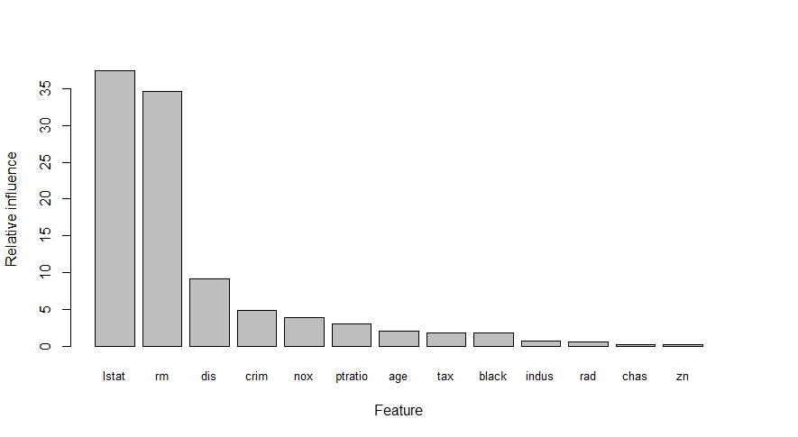

# R Tools for Visual Studio Sample Projects

This collection of samples will get you started on R, Microsoft R Server and 
R Tools for Visual Studio. To get them:

1. Download [the zip file](https://github.com/Microsoft/RTVS-docs/archive/master.zip).
2. Unzip.
3. Open `examples/Examples.sln`.

`README` files will help you navigate the samples.

At the top level, ** A First Look at R ** gives a gentle introduction
for newcomers to R. ** MRS and Machine Learning ** gives examples of how to
use R and Microsoft R Server for machine learning.

For a technical comparison of R with MRS, check out [Lixun Zhang's
detailed discussion](http://htmlpreview.github.io/?https://github.com/lixzhang/R-MRO-MRS/blob/master/Introduction_to_MRO_and_MRS.html) on the topic. 

## Microsoft R Server

These examples show off the power of [Microsoft R
Server](https://www.microsoft.com/en-us/server-cloud/products/r-server/), which
lets you work with datasets that are too large to fit in memory.

### rxGLM() benchmark

This example demonstrates the differences between CRAN R and R server.
Specifically, it shows how the difference in performance between rxGlm() and
glm(). The R server function rxGlm() fits a generalized linear model on data
that is potentially much larger than available RAM.

### Flight delay prediction

This example uses historical on-time performance and weather data to predict
whether the arrival of a scheduled passenger flight will be delayed by more than
15 minutes. It uses datasets from the Github repository for the examples. While
the datasets are relatively small for the purposes of illustration, in practice
you can scale those datasets to whatever size makes sense for your application.

### R and R Server comparison

The comparison of using R and R Server consists of three examples, each illustrating a slightly different aspect:

* R_MRO_MRS_Comparison_Part_1_Functions.R

  - Demonstrates how to do cluster analysis using `kmeans()` and `rxKmeans()`.
  - The sample creates some simulated data in two overlapping groups, then finds the cluster allocation and cluster centres.
  
    
  
* R_MRO_MRS_Comparison_Part_2_Capacity.R

  - This demonstrates the `rxKmeans()`, like all the `rx` functions, can handle much larger datasets than CRAN R functions.
  
* R_MRO_MRS_Comparison_Part_3_Speed.R

  - This compares the execution speed of clustering using `kmeans()` and `rxKmeans()`, demonstrating that for this algorithm there is no inherent performance benefit of using `rxKmeans()`, but `rxKmeans()` can handle much larger datasets.
  
    
  

### Bike rental estimation

This example demonstrates the Feature Engineering process for building a
regression model to predict bike rental demand using historical datasets.
Similar to the previous example, the datasets are relatively small (17,379 rows
and 17 columns) for the purposes of illustration, but can be scaled to whatever
size makes sense for your application.

## Microsoft R Open (R with MKL) 

These examples show off the power of [Microsoft R
Open](https://mran.revolutionanalytics.com/open/), Microsoft's distribution of R
which has two key differentiators over [CRAN R](https://cran.r-project.org/):

1. [Better computation
   performance](https://mran.revolutionanalytics.com/rro/#intelmkl1) when
   coupled with the [Intel Math Kernel
   Libraries](https://software.intel.com/en-us/intel-mkl) which are available as
   a free download from Microsoft for use with Microsoft R Open. 

1. [Reproducible R
   Toolkit](https://mran.revolutionanalytics.com/rro/#reproducibility), which
   ensures that the libraries that you built your R program with are always
   available to others that want to reproduce your work.

### Benchmarks

This example runs a number of compute-intensive benchmarks to show the
performance gains that are possible through the use of the Intel Math Kernel
Libraries in Microsoft R Open. This sample produces a box plot showing the
impact of running the same computation on multiple cores:

### Deploying an Azure Machine Learning web service

This example shows how you can create a linear regression model using R, and
then publish it as an Azure Web Service using an [Azure Machine
Learning](https://azure.microsoft.com/en-us/services/machine-learning/)
workspace.

## Introduction to R and Machine Learning

### Gradient Boosting Machine

This example uses a Gradient Boosting machine to create a model that predicts
[housing prices in the suburbs of
Boston](https://cran.r-project.org/web/packages/MASS/MASS.pdf) based on features
such as per-capita crime statistics, number of rooms per dwelling and the
property tax rate. Note that it takes quite some time to run this model, so
don't expect immediate results. If you find that it takes too long, there is a
commented out block of code that you can substitute that has a smaller parameter
tuning grid.

The output of this example is a plot of features showing the relative influence
of each one on the model:

