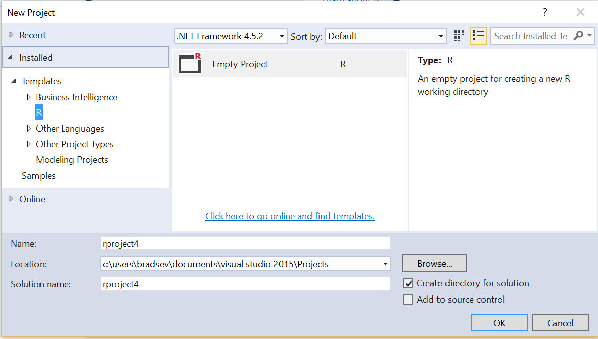
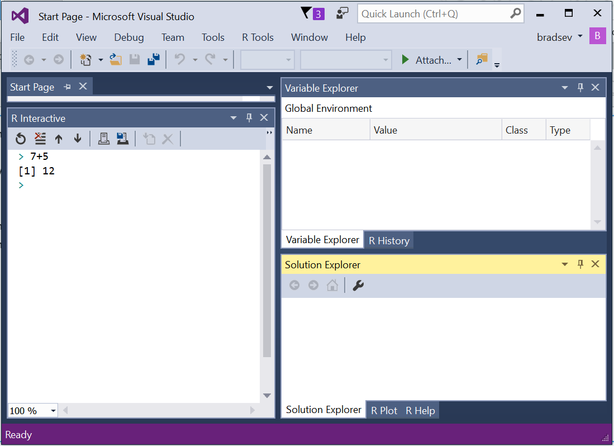

# How to start a new project using R Tools for Visual Studio

1. Start Visual Studio 2015
2. Choose **File** -> **New** -> **Project...**
3. Select the Empty Project from the R templates.

4. Name the project in the **Name:** box.
5. Test that the R **Interactive** pane is working by typing in 5 + 7 and then **Enter** to see the answer displayed.
