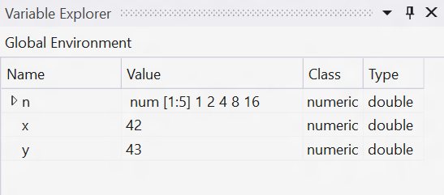
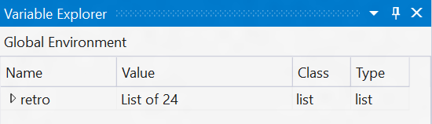
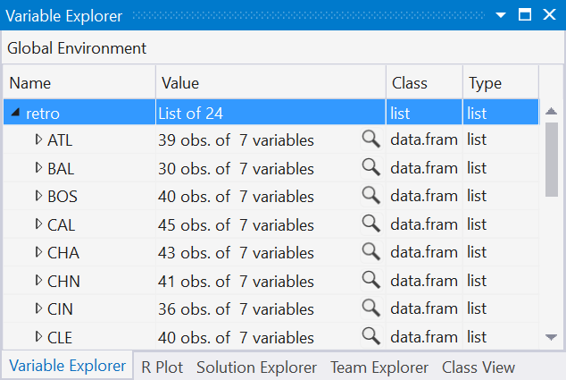

# Variable Explorer

The Variable Explorer provides a list of all variables at global scope from the
REPL. So, if in the REPL you executed: 

```r
x <- 42
y <- 43
n <- c(1,2,3,5,8,13)
```
 
The variable explorer will display the following data:



If you have a more complex R data frame defined in the REPL, you can drill into
the data. If you execute these commands:
 
```r
cars <- mtcars
```

You will see this view in the Variable Explorer:


 
Next we click on the chevron to drill into the data:



We can drill as deep as the data is nested within the data frame:
 


## Data Table Viewer

Since the data for each team is *tabular*, it makes sense to view them in a
table form. If you click on the magnifying glass icon next to the team name, you'll
open up the Data Table Viewer:


The column headings in the data table viewer control the sorting behavior of a
column. You can click on a single column heading to toggle between sorting
ascending and descending by that column. If you hold down the SHIFT key while
clicking on the column headings, you can multi-select several columns. The
sequence in which you click the column headings determines the order in which
the sorting is performed. For example, in the figure below, we are sorting first
by cylinder, and then by displacement.


## Export to Excel

While the data table viewer is a great tool, sometimes you want to be able to
take your data frame and *export* it to Excel. You can easily do this by
clicking on the small Excel icon to the variable explorer. When you click on it,
it will take your data frame and export it to a new Excel Workbook:


We do this by writing a new CSV file containing the contents of the dataframe to the `%USERPROFILE%\Documents\RTVS_CSV_Exports` directory.

## Scopes 

We now let you pick different _scopes_ for the variables in the variable
explorer; previously you could only examine variables at global scope. Now, with
package level scope, we give you a view over all of the variables (including
functions, which are just functions bound to variables) defined within a
package:


TODO: investigate this further with simple example and caveats and benefits
(e.g., export to Excel)

When you are debugging, variable explorer also recognizes the current execution
scope (i.e., when you are debugging code within a function). Here, local
variables that you define within that function can now be inspected using
variable explorer. In the picture below, you can see that the current execution
scope is within a function called `renderUI`, and that there are two
local variables defined at the current execution point: `country_data` and
`max_destinations`:


## TODO: Importing data into Variable Explorer
